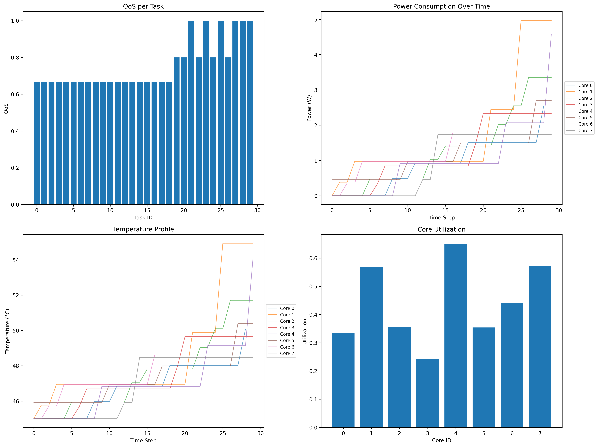
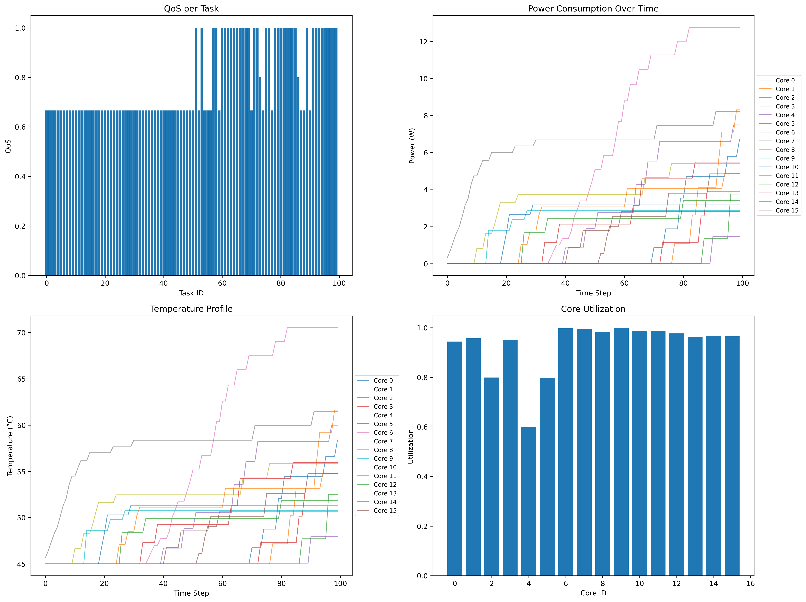
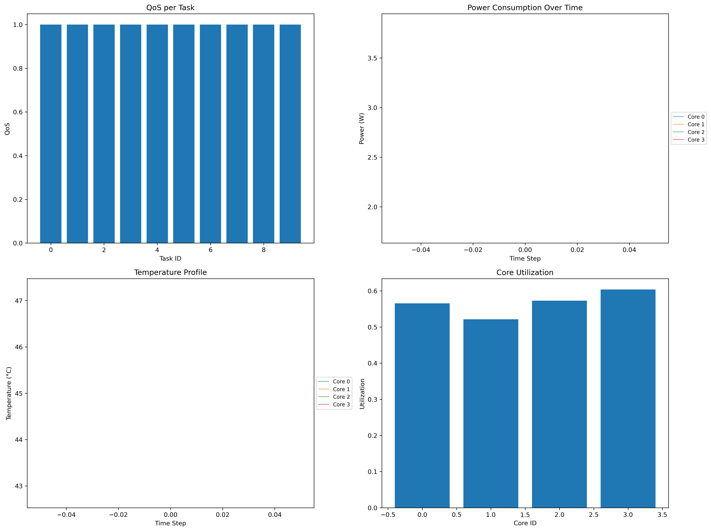
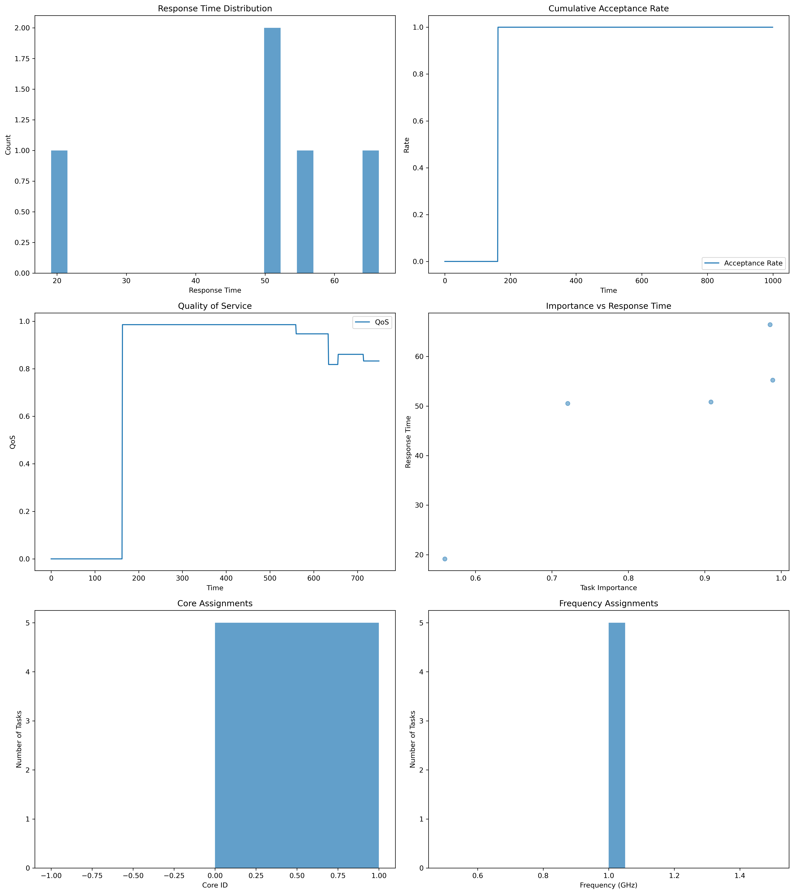
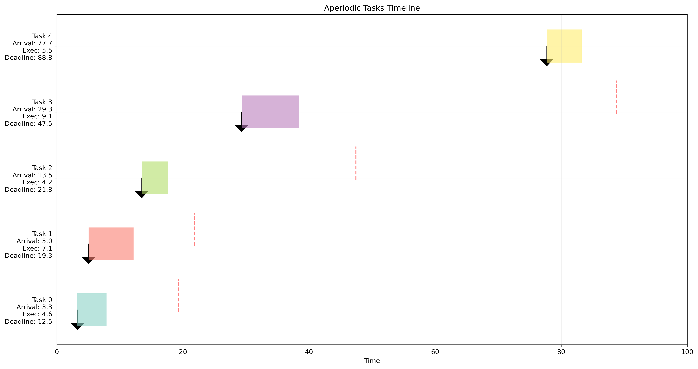

# RL-based DVFS scheduling

## Introduction
In this project, we propose a reinforcement learning-based DVFS scheduling algorithm for energy-efficient real-time systems. The proposed algorithm is designed to minimize the energy consumption of real-time systems while satisfying the timing constraints of tasks. Actually, the RL agent tries to keep the correct trade-off between frequency and voltage (higher frequency and voltage lead to higher energy consumption but faster and better performance). The proposed algorithm is evaluated on a set of synthetic task sets (having specific meaningful characteristics) using a customized version of UUniFast. 

## Installation
To install the required packages, you can use the following command:
```bash
pip install -r requirements.txt
```
It is recommended to use a virtual environment to avoid conflicts with other packages. (like conda)
```bash
conda create -n myenv python=3.8
conda activate myenv
```

## Usage
To test and visualize the task set generation (using the custom UUniFast algorithm), you can use the following command:

```bash
python3 test_task_generation.py
```
and the results (charactersitics of the generated task sets) will be printed and the plots will be saved in the root folder.

To train the RL agent, you can use the following command:
```bash
python3 train_and_evaluate_agent.py
```

The results (including characteristics) will be printed and the plots will be saved in the `results/` folder.

Also if you want to train your agent on pre-specified scenarios (including different utilization values and number of cores), you can use the following command:
```bash
python3 run_multiple_scenarios.py
```

The results (including characteristics) will be printed and the plots will be saved in the `results/` folder.

You can see a few samples of the plots, below:





Also, the scheduled tasks and their details will be saved as a `.csv` file in the same directory.

# Hybrid Scheduling
We also propose a hybrid scheduling algorithm (hard-deadline periodic + soft-deadline aperiodic). To test the hybrid scheduling algorithm, you can use the following command:

```bash
python3 run_hybrid_scheduling.py
```
Which will result in logging different metrics  and plots like below:




also if you want to see a sample generated aperiodic set of tasks, run the following command:

```bash
python3 test_aperiodic.py
```
Which will result in a plot like this:

